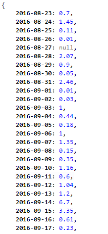
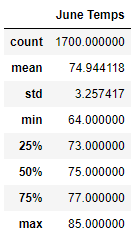
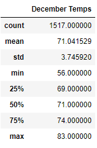
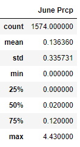
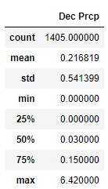

# surfs_up
## Overview of the analysis: 
Climate Analysis and Data Exploration of Climate Database Using Python (Pandas, Matplotlib), SQLAlchemy (ORM Queries) and Flask of the city of Oahu, Hawaii in order to see if there are proper conditions to open a surfing and ice cream store.
## Resources:
* Data: hawaii.sqlite
* Software: Python 3.9.5, Jupyter Notebook 6.3.0
## Results: 
### STEP 1: Climate Analysis and Exploration
Using Python nd SQLAlchemy a basic climate analysis and exploration of the data of the climate database. The following analysis was performed:
#### Precipitation Analysis
* Design a query to retrieve the precipitation data of the last year and displaying only <code>date</code> and <code>prcp</code> values.
* Store the query in a pandas dataframe, set the index as the date column and sort the values by date.
* Use Matplotlib to plot the data from the pandas dataframe.
* Use the <code>describe()</code> method to  obtain the summary statistic for the precipitation data.
#### Station Analysis
* Design a query to obtain how many <code>stations</code> were available in the analysis.
  * List the stations and the number of observations in descending order.
  * Obtain the station with the highest number of observations.
* Using the data from the highest performing station obtain:
  * The <code>lowest temperature</code> recorded.
  * The <code>highest temperature</code> recorded.
  * The <code>average temperature</code> recorded.
  * Retrieve the last 12 months of tobs (Temperature Observations) and plot the results in a histogram.

### STEP 2: Climate App
#### Hawaii Climate App (Flask API)
Design a Flask API based on the queires that have been developed in the previous step.
##### Setting up Flask
Adding the neccesary code to start developing a web application with flask

        from flask import Flask, jsonify
        app = Flask(__name__)
        (----- YOUR ROUTES -----)
        if __name__ == '__main__':
           app.run(debug=True)
           
##### Adding Routes
The next routes were defined in order to display different results from th eprevious step, the routes were:
* The welcome route: <code>@app.route("/")</code>
  * A welcome route that displays the title and the available routes of our web app.
   
* The precipitation route: <code>@app.route("/api/v1.0/precipitation")</code>
  * Convert the query results to a dictionary using <code>date</code> as a key and <code>prcp</code> as a value.
  * Return the JSON file of the dictionary. 
  
  
* The stations route: <code>@app.route("/api/v1.0/stations")</code>
  * Return a JSON list containing the stations of the database.
  
* The mothly temperature route: <code>@app.route("/api/v1.0/tobs")</code>
  * Query the dates and tobs from last year.
  * Return a JSON list of tobs for the las year. 
  
* The measurements of central tendency route: <code>@app.route("/api/v1.0/temp/start")</code> and <code>@app.route("/api/v1.0/temp/start/end")</code>
 * Query a list of the minimun, maximum and average temperatures of a given <code>start</code> and <code>end</code> date.
 * If no end date was provided, it will return the results of any available date greater than or equal than the starting date.
  
  
## Challenge
In this week challenge, it was required to create a query to retrieve information from our database filtering from two different months: June and December. Analyzing this two very different climate months we could discover if the surf and ice cream shop is sustainable all year-round.

### Results
Here we can see the tables obtained from tha analysis performed for both months.
 
Temperature Measurements (June)    |  Temperature Measurements (December)
:-------------------------:|:-------------------------:
    |  
 
With this results we get the next insights:
* June temperatures range from 64°F to 85°F whereas December temperatures range from 56°F to 83°F.
* The average temperature for the month of June is 74.94°F, which is 3 degrees higher than the average temperature in the month of December with 71.04°F.
* The minimum recorde temperature from June was 64°F in comparisson of the minimum temperature in December that was 56°F, 8 degrees less.

## Summary: 
As we can see from the results in the previous sections, there is not a significant difference in the temperatures recorded from the months of June and December over the years, the hottest temperature recorded in Summer is just 3°F degrees higher than the max temperature in Winter. The coldest temperature has a wider range between the two months with a difference of 8°F degrees, however, this is an acceptable average temperature for maintaining a business of ice cream and surfing.
 
More information can be obtained with other queries, my proposal is to display the same analysis done to the temperatures of June and December but now for the precipitation of this months, the queries and results are displayed below:
 *  For precipitation in June:
 
        June_prcp = session.query(Measurement.date, Measurement.prcp).\
        filter(extract('month', Measurement.date)==6).all()

        df = pd.DataFrame(June_prcp, columns = ['date', 'June Prcp'])
        df.set_index(df['date'], inplace=True)
        df_june=df[['June Prcp']]
        df_june.describe()

 * For precipitation in December:
 
       Dec_prcp = session.query(Measurement.date, Measurement.prcp).\
       filter(extract('month', Measurement.date)==12).all()

       df = pd.DataFrame(Dec_prcp, columns = ['date', 'Dec Prcp'])
       df.set_index(df['date'], inplace=True)
       df_dec=df[['Dec Prcp']]
       df_dec.describe()
 
With the new tables we can observe that the average precipitation is much higher in December <code>0.2168</code> compared to June <code>0.1363</code>, about a <code>62.86%</code> higher. However, the standard deviation of December rains <code>0.5413</code> is much higher thant the rains in June <code>0.3357</code>, that could mean irregular rainy days all over the month of December. This are some points to take in consideration in the business plan.
 
 Precipitation Measurements (June)    |  Precipitation Measurements (December)
:-------------------------:|:-------------------------:
    |  
